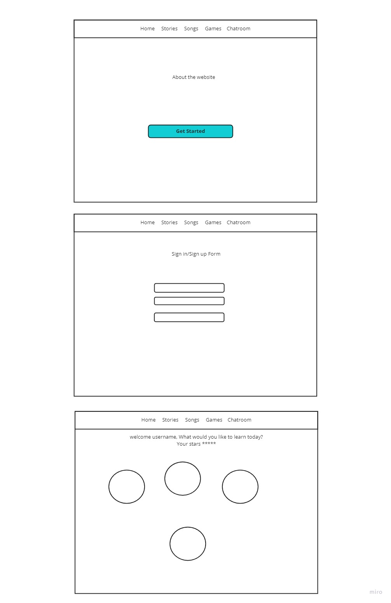
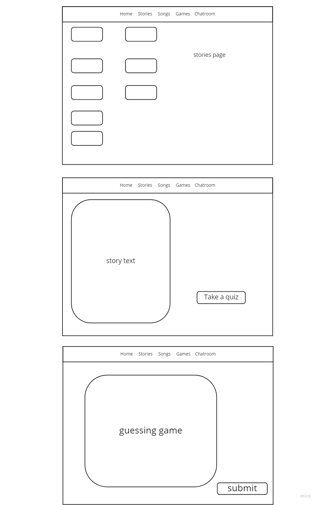
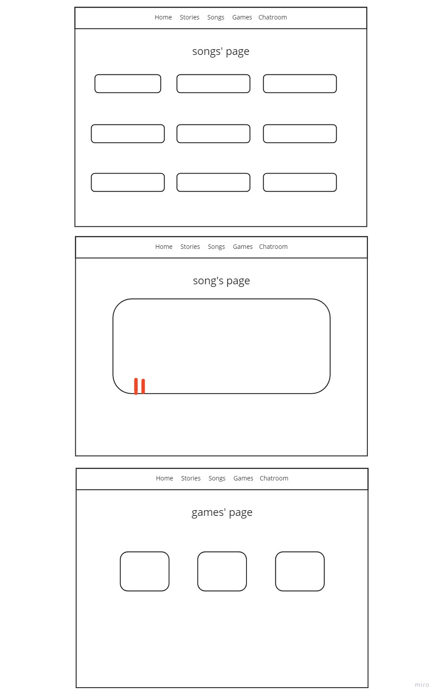
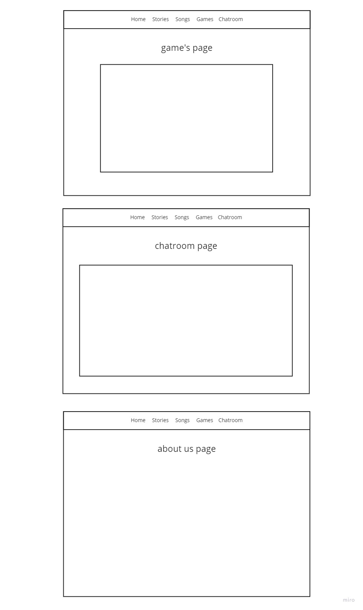
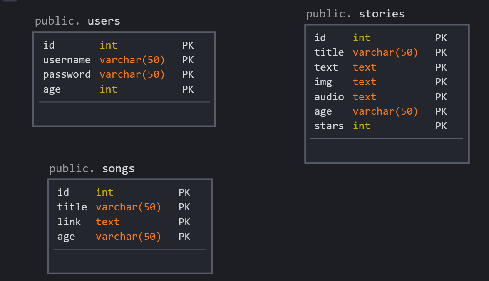

# kids-app

## Team members :
- Mais Abdelrazeq 
- Joudi Awameh 
- Sondos AL-Braim 
- Diala Abdalqader
- Rand Al-Sallaq
## problem Domain 
### Usually, children do not know how to use their time by both having fun and learning. Our website allows kids to create an account and enjoy the educational games.4

## User Stories
- As a user, I want to see the home page with different options; stories, games, and songs.
- The stories should be generated depending on some inputs.
- I would like to listen to these stories.
- A game should be included too.
- I would like to listen to some songs as well.
- I would like to have the ability to communicate with other children on the website.
- I would like to get points when I do any activity so that my rank will be higher. 

## Wireframe

## Domain Modeling

